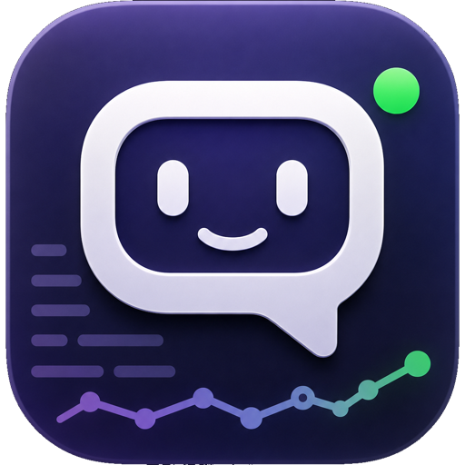
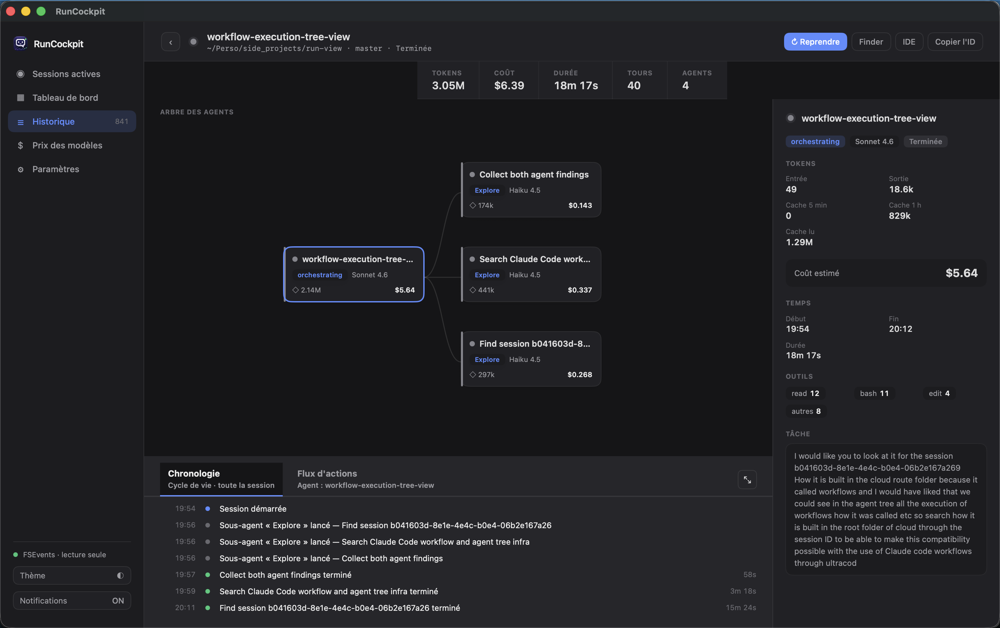
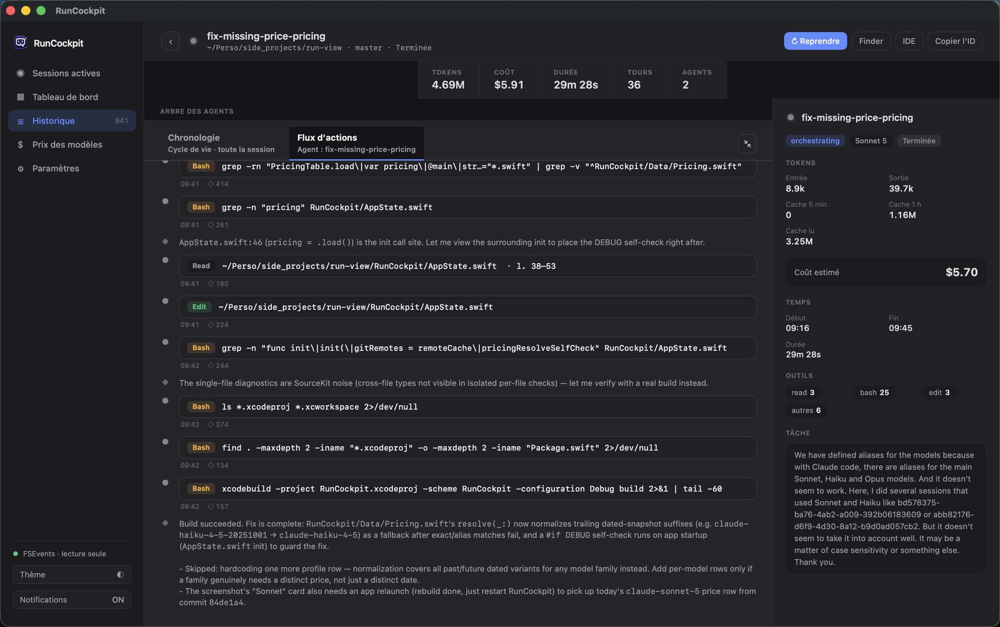
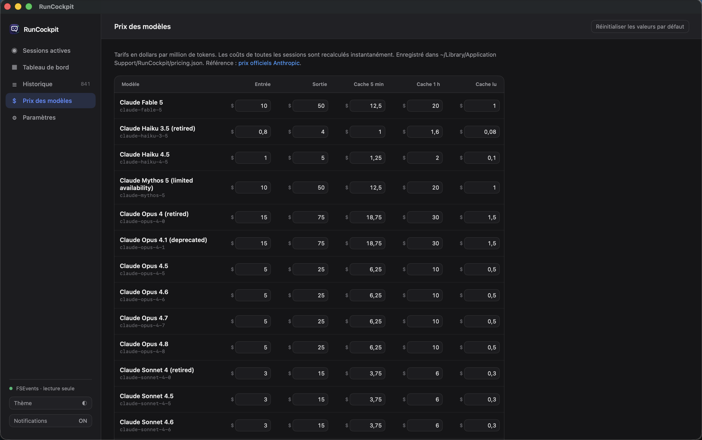
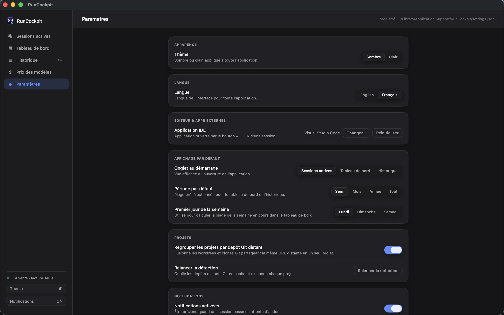

<p align="center">
  
</p>

<h1 align="center">RunCockpit</h1>

<p align="center">
  A native macOS dashboard for watching your <a href="https://claude.com/product/claude-code">Claude Code</a> sessions — live, local, read-only.
</p>

---

RunCockpit answers "what is Claude doing right now, and what has it cost me?" without making you grep through JSONL files by hand. It watches `~/.claude/` on your Mac and turns it into a real-time dashboard: which agents are busy vs. waiting on you, a visual tree of every sub-agent a session spawned, and a running token/cost tally per session, project, and model.

It's a pure SwiftUI app with **zero external dependencies**, **zero network calls**, and **zero telemetry**. It never writes to `~/.claude/` — its own data (cache, pricing, settings) lives entirely under `~/Library/Application Support/RunCockpit/`.

## Screenshots

**Session detail — agent tree**
Every session is inspectable as a graph of agents and sub-agents, drawn on a plain SwiftUI `Canvas`. Click a node to inspect its tokens, cost, tools used, and prompt.



**Action flux**
A chronological stream of everything an agent did — reasoning blocks and tool calls, each with duration, tokens, and a result preview.



**Editable model pricing**
Default pricing is seeded from Anthropic's published rates and fully editable per model, per token bucket (input, output, cache write 5m/1h, cache read). Every cost figure in the app recalculates instantly.



**Settings**
Theme, language (English/French), notification toggle, and default IDE.



> Active Dashboard, History, and Statistics screens: screenshots coming soon.

## Features

- **Active dashboard** — two real-time columns: sessions *waiting on you* vs. sessions *still running*, updated via filesystem events (no polling).
- **History** — every finished session, searchable by title, path, branch, or model, with token/cost totals.
- **Session detail** — agent/sub-agent tree, chronological timeline, and a full action-by-action flux view, side by side with an inspector panel.
- **Editable pricing table** — 13 models, 5 token buckets each, persisted locally and reset-able to defaults.
- **Native notifications** — a banner when a session flips from busy to idle, independent of system-level notification permission state.
- **Resume or terminate sessions** from the UI — resume opens a ready-to-run `claude --resume <id>` command in Terminal; terminate sends `SIGTERM` behind a confirmation dialog.

## How it works

Everything is read straight off the local filesystem — there is no server, no API key, no network call anywhere in the app.

| Reads from | Contains |
|---|---|
| `~/.claude/sessions/<PID>.json` | Live session registry: PID, session ID, working directory, status |
| `~/.claude/projects/<hash>/<sessionId>.jsonl` | Transcript: messages, tool calls, tokens, git branch, title |
| `~/.claude/projects/<hash>/<sessionId>/subagents/agent-*.jsonl` | Per-sub-agent transcript |
| `~/.claude/projects/<hash>/<sessionId>/subagents/agent-*.meta.json` | Sub-agent metadata (type, description, depth) |

| Writes to | Contains |
|---|---|
| `~/Library/Application Support/RunCockpit/settings.json` | Appearance, notifications, editor path, language |
| `~/Library/Application Support/RunCockpit/pricing.json` | Editable model pricing table |
| `~/Library/Application Support/RunCockpit/history-cache.json` | Parsed-history cache, invalidated by file mtime |

File changes are picked up via `FSEventStreamCreate` (CoreServices), debounced ~400ms at the kernel level and ~250ms on the main queue — no polling loop. Liveness of a session is checked with a `kill(pid, 0)` syscall.

For the full technical breakdown (architecture, navigation routes, entity model, system behaviors), see [FEATURES.md](FEATURES.md).

## Requirements

- macOS 15 (Sequoia) or later
- Xcode 16 or later to build from source

## Install

RunCockpit isn't notarized (no paid Apple Developer membership), so macOS quarantines it after download. It's open source, read-only, and makes zero network calls — you can audit the source or build it yourself. Two ways to install the prebuilt app:

**Homebrew (recommended)**

```bash
brew install --cask greggoire/tap/run-cockpit
xattr -dr com.apple.quarantine /Applications/RunCockpit.app
```

The second command clears the quarantine flag Homebrew applies — required because the app isn't notarized; without it macOS reports the app as "damaged".

**Direct download**

Grab the latest `RunCockpit.dmg` from [Releases](https://github.com/greggoire/run-cockpit/releases/latest), drag the app to `/Applications`, then clear the quarantine flag:

```bash
xattr -dr com.apple.quarantine /Applications/RunCockpit.app
open /Applications/RunCockpit.app
```

## Build from source

No Apple Developer account needed — build and run locally with an ad-hoc signature:

```bash
scripts/build-local.sh          # produces build/RunCockpit.app
scripts/build-local.sh --dmg    # also produces build/RunCockpit.dmg
open build/RunCockpit.app
```

First launch: right-click the app → **Open** (bypasses Gatekeeper for an unsigned/ad-hoc app), then grant the permissions macOS asks for.

Or just open `RunCockpit.xcodeproj` in Xcode and hit Run.

To build a notarized DMG for distribution to other Macs (requires an Apple Developer Program membership), see `scripts/package-developer-id.sh`.

## Contributing

See [CONTRIBUTING.md](CONTRIBUTING.md).

## License

RunCockpit is licensed under the [GNU General Public License v3.0](LICENSE).

## Acknowledgments

Default model pricing is sourced from [Anthropic's official pricing page](https://platform.claude.com/docs/en/about-claude/pricing).
